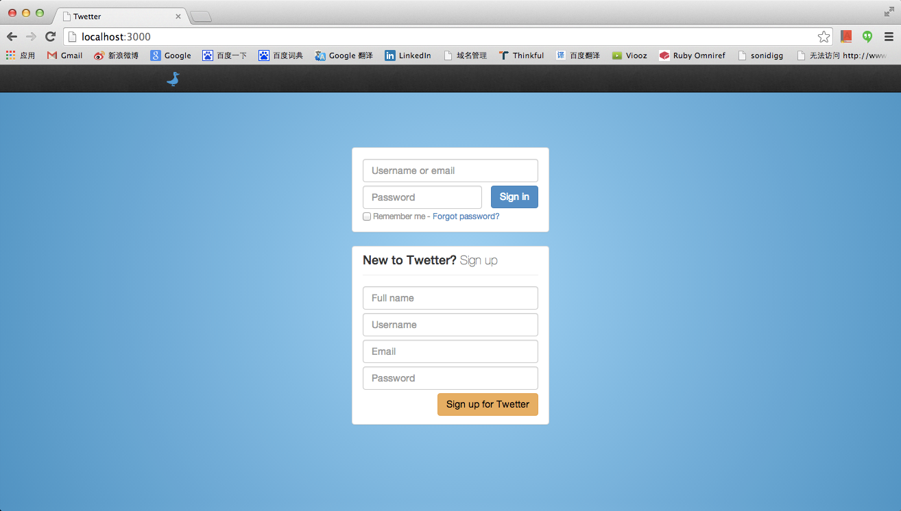
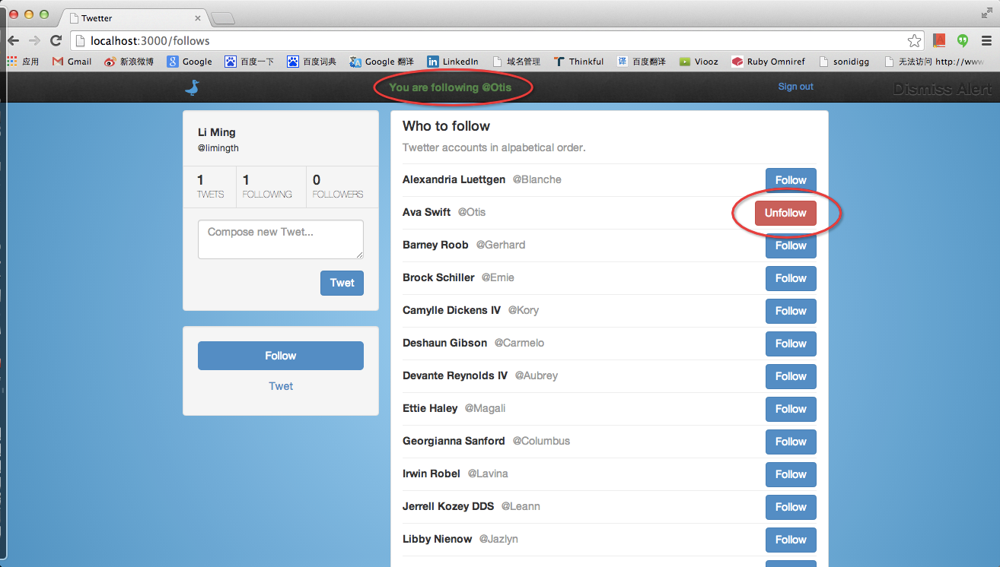
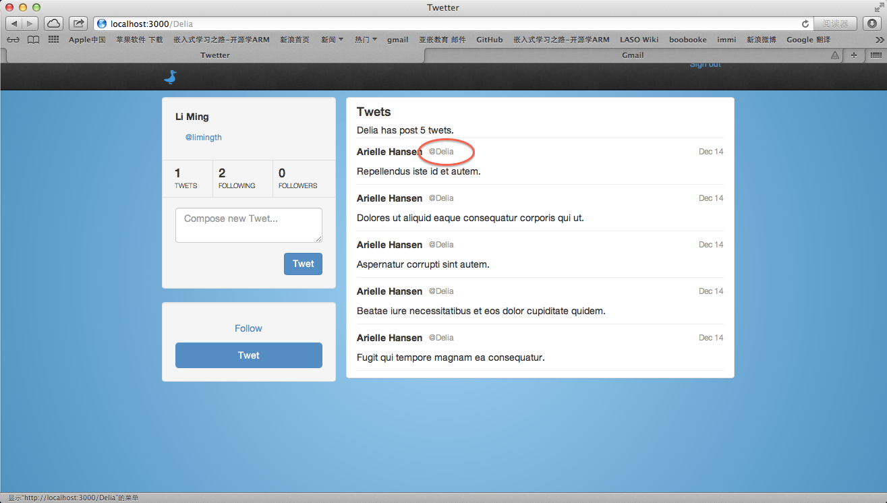
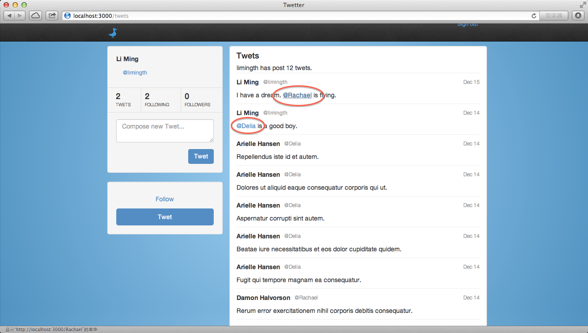
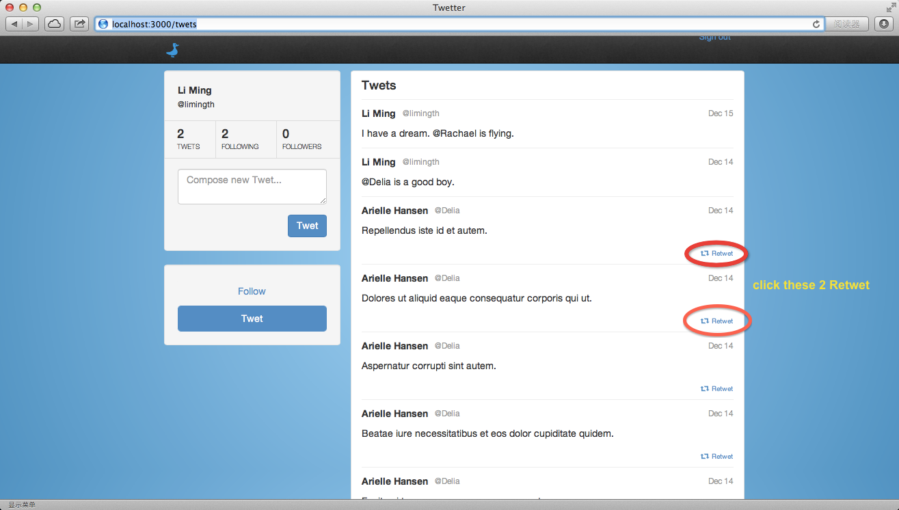

# Twetter Project

## Fork the Twetter Repository

### Fork the repo
<https://github.com/Thinkful/twetter>

### git clone 
	limingth@gmail ~/Github/myRoR$ git clone https://github.com/limingth/twetter
	Cloning into 'twetter'...
	remote: Counting objects: 730, done.
	remote: Compressing objects: 100% (277/277), done.
	remote: Total 730 (delta 420), reused 719 (delta 409)
	Receiving objects: 100% (730/730), 265.09 KiB | 200.00 KiB/s, done.
	Resolving deltas: 100% (420/420), done.
	Checking connectivity... done
	limingth@gmail ~/Github/myRoR$ 

### get a list of the remote branches
	limingth@gmail ~/Github/myRoR$ git branch -r
	  origin/HEAD -> origin/master
	  origin/gh-pages
	  origin/master
	limingth@gmail ~/Github/myRoR$ 

### Navigate to Twetter
	limingth@gmail ~/Github/myRoR$ cd twetter/
	RVM used your Gemfile for selecting Ruby, it is all fine - Heroku does that too,
	you can ignore these warnings with 'rvm rvmrc warning ignore /Users/limingth/Github/myRoR/twetter/Gemfile'.
	To ignore the warning for all files run 'rvm rvmrc warning ignore allGemfiles'.

	limingth@gmail ~/Github/myRoR/twetter$ 

### Install the required gems 
	limingth@gmail ~/Github/myRoR/twetter$ bundle install
	Fetching gem metadata from https://rubygems.org/.........
	Fetching gem metadata from https://rubygems.org/..
	Using rake (10.1.0) 
	Using i18n (0.6.5) 
	Using minitest (4.7.5) 
	Using multi_json (1.8.2) 
	Using atomic (1.1.14) 
	Using thread_safe (0.1.3) 
	Using tzinfo (0.3.38) 
	Installing activesupport (4.0.0) 
	Using builder (3.1.4) 
	Using erubis (2.7.0) 
	Using rack (1.5.2) 
	Using rack-test (0.6.2) 
	Installing actionpack (4.0.0) 
	Using mime-types (1.25) 
	Using polyglot (0.3.3) 
	Using treetop (1.4.15) 
	Using mail (2.5.4) 
	Installing actionmailer (4.0.0) 
	Installing activemodel (4.0.0) 
	Using activerecord-deprecated_finders (1.0.3) 
	Using arel (4.0.1) 
	Installing activerecord (4.0.0) 
	Using bcrypt-ruby (3.1.2) 
	Using sass (3.2.12) 
	Installing bootstrap-sass (3.0.0.0.rc2) 
	Using coffee-script-source (1.6.3) 
	Using execjs (2.0.2) 
	Using coffee-script (2.2.0) 
	Using thor (0.18.1) 
	Installing railties (4.0.0) 
	Using coffee-rails (4.0.1) 
	Installing orm_adapter (0.4.0) 
	Installing warden (1.2.3) 
	Installing devise (3.1.1) 
	Installing diff-lcs (1.2.4) 
	Installing factory_girl (4.2.0) 
	Installing factory_girl_rails (4.2.1) 
	Installing ffaker (1.20.0) 
	Using hike (1.2.3) 
	Using jbuilder (1.5.2) 
	Using jquery-rails (3.0.4) 
	Using json (1.8.1) 
	Using libv8 (3.16.14.3) 
	Using bundler (1.3.5) 
	Using tilt (1.4.1) 
	Using sprockets (2.10.0) 
	Using sprockets-rails (2.0.1) 
	Installing rails (4.0.0) 
	Using rdoc (3.12.2) 
	Using ref (1.0.5) 
	Installing rspec-core (2.14.6) 
	Installing rspec-expectations (2.14.3) 
	Installing rspec-mocks (2.14.4) 
	Installing rspec-rails (2.14.0) 
	Using sass-rails (4.0.1) 
	Using sdoc (0.3.20) 
	Installing shoulda-matchers (2.4.0) 
	Using sqlite3 (1.3.8) 
	Using therubyracer (0.12.0) 
	Using turbolinks (1.3.0) 
	Installing uglifier (2.3.0) 
	Your bundle is complete!
	Use `bundle show [gemname]` to see where a bundled gem is installed.
	limingth@gmail ~/Github/myRoR/twetter$ 

### take a look at the .gitignore file 
	limingth@gmail ~/Github/myRoR/twetter$ cat .gitignore 
	  1 *.rbc
	  2 *.sassc
	  3 .sass-cache
	  4 capybara-*.html
	  5 .rspec
	  6 .rvmrc
	  7 /.bundle
	  8 /vendor/bundle
	  9 /log/*
	 10 /tmp/*
	 11 /db/*.sqlite3
	 12 /public/system/*
	 13 /coverage/
	 14 /spec/tmp/*
	 15 **.orig
	 16 rerun.txt
	 17 pickle-email-*.html
	 18 .project
	 19 config/initializers/secret_token.rb  <--- see here
	 20 .DS_Store

### create the appropriate file
	limingth@gmail ~/Github/myRoR/twetter$ echo "Twetter::Application.config.secret_key_base = '`bundle exec rake secret`'" > config/initializers/secret_token.rb
	limingth@gmail ~/Github/myRoR/twetter$ cat config/initializers/secret_token.rb
	Twetter::Application.config.secret_key_base = '048de940e47baed979595f46fea6715a75b901509a3ac797c2a308624c0f4bea5fd3baa2c951dbc652debf7f9ed8d8dbd40ba5513457c52be8153fffeb73af60'

* see that it sets a property on your Twetter application. config.secret_key_base is set to a randomly generated string.

### Set Up Your Database and Migrate Your Models
	limingth@gmail ~/Github/myRoR/twetter$ bundle exec rake db:create db:migrate db:test:prepare
	==  DeviseCreateUsers: migrating ==============================================
	-- create_table(:users)
	   -> 0.0101s
	-- add_index(:users, :email, {:unique=>true})
	   -> 0.0016s
	-- add_index(:users, :reset_password_token, {:unique=>true})
	   -> 0.0013s
	-- add_index(:users, :unlock_token, {:unique=>true})
	   -> 0.0012s
	==  DeviseCreateUsers: migrated (0.0147s) =====================================

	==  AddNameToUsers: migrating =================================================
	-- add_column(:users, :name, :string)
	   -> 0.0015s
	==  AddNameToUsers: migrated (0.0017s) ========================================

	==  AddUsernameToUsers: migrating =============================================
	-- add_column(:users, :username, :string)
	   -> 0.0017s
	==  AddUsernameToUsers: migrated (0.0023s) ====================================

	==  CreateFollows: migrating ==================================================
	-- create_table(:follows)
	   -> 0.0023s
	==  CreateFollows: migrated (0.0029s) =========================================

	==  CreateTweets: migrating ===================================================
	-- create_table(:tweets)
	   -> 0.0019s
	-- add_index(:tweets, :user_id)
	   -> 0.0009s
	==  CreateTweets: migrated (0.0030s) ==========================================

	==  AddIndeciesToFollows: migrating ===========================================
	-- add_index(:follows, [:user_id, :following_id])
	   -> 0.0015s
	==  AddIndeciesToFollows: migrated (0.0020s) ==================================

	==  ChangeTweetToTwet: migrating ==============================================
	==  ChangeTweetToTwet: migrated (0.0023s) =====================================

	limingth@gmail ~/Github/myRoR/twetter$ 

### Seed Your Data
	limingth@gmail ~/Github/myRoR/twetter$ bundle exec rake seed:users
	limingth@gmail ~/Github/myRoR/twetter$ bundle exec rake seed:twets
	limingth@gmail ~/Github/myRoR/twetter$ 

#### Here You can use rails c to check it
	limingth@gmail~/Github/twetter$ rails c
	Loading development environment (Rails 4.0.0)
	2.0.0p247 :005 > User.count
	   (0.9ms)  SELECT COUNT(*) FROM "users"
	 => 20 
	2.0.0p247 :006 > Twet
	 => Twet(id: integer, user_id: integer, content: string, created_at: datetime, updated_at: datetime) 
	2.0.0p247 :007 > Twet.count
	   (0.4ms)  SELECT COUNT(*) FROM "twets"
	 => 100 
	2.0.0p247 :008 > 

* see there are 20 user in database and everyone has 5 twets (20*5=100 twets in total)

### Start the Server
	limingth@gmail ~/Github/myRoR/twetter$ bundle exec rails s
	=> Booting WEBrick
	=> Rails 4.0.0 application starting in development on http://0.0.0.0:3000
	=> Run `rails server -h` for more startup options
	=> Ctrl-C to shutdown server
	[2013-12-12 12:28:27] INFO  WEBrick 1.3.1
	[2013-12-12 12:28:27] INFO  ruby 2.0.0 (2013-06-27) [x86_64-darwin12.4.0]
	[2013-12-12 12:28:27] INFO  WEBrick::HTTPServer#start: pid=21245 port=3000

### Visit Twetter
* In your browser of choice, go to localhost:3000

* after you sign up your account, you can see this page

* if you follow other users, there’s a message that flashes in the center of the navbar.

### Do yourself
* Try to dismiss flashed messages by clicking the “Dismiss message” link in the rightside of navbar.

## Get to Know the Twetter Code Base

### Get a Quick Overview of Your Routes
	limingth@gmail ~/Github/myRoR$ cd twetter
	RVM used your Gemfile for selecting Ruby, it is all fine - Heroku does that too,
	you can ignore these warnings with 'rvm rvmrc warning ignore /Users/limingth/Github/myRoR/twetter/Gemfile'.
	To ignore the warning for all files run 'rvm rvmrc warning ignore allGemfiles'.

	limingth@gmail ~/Github/myRoR/twetter$ rake routes
	                  Prefix Verb   URI Pattern                    Controller#Action
	        new_user_session GET    /users/sign_in(.:format)       devise/sessions#new
	            user_session POST   /users/sign_in(.:format)       devise/sessions#create
	    destroy_user_session DELETE /users/sign_out(.:format)      devise/sessions#destroy
	           user_password POST   /users/password(.:format)      devise/passwords#create
	       new_user_password GET    /users/password/new(.:format)  devise/passwords#new
	      edit_user_password GET    /users/password/edit(.:format) devise/passwords#edit
	                         PATCH  /users/password(.:format)      devise/passwords#update
	                         PUT    /users/password(.:format)      devise/passwords#update
	cancel_user_registration GET    /users/cancel(.:format)        devise/registrations#cancel
	       user_registration POST   /users(.:format)               devise/registrations#create
	   new_user_registration GET    /users/sign_up(.:format)       devise/registrations#new
	  edit_user_registration GET    /users/edit(.:format)          devise/registrations#edit
	                         PATCH  /users(.:format)               devise/registrations#update
	                         PUT    /users(.:format)               devise/registrations#update
	                         DELETE /users(.:format)               devise/registrations#destroy
	             user_unlock POST   /users/unlock(.:format)        devise/unlocks#create
	         new_user_unlock GET    /users/unlock/new(.:format)    devise/unlocks#new
	                         GET    /users/unlock(.:format)        devise/unlocks#show
	                 follows GET    /follows(.:format)             follows#index
	                         POST   /follows(.:format)             follows#create
	                  follow DELETE /follows/:id(.:format)         follows#destroy
	                   twets GET    /twets(.:format)               twets#index
	                         POST   /twets(.:format)               twets#create
	                    twet DELETE /twets/:id(.:format)           twets#destroy
	               user_root GET    /                              follows#index
	                    root GET    /                              home#index
	limingth@gmail ~/Github/myRoR/twetter$ 

#### Look at the 3rd from the bottom row. 

	twets GET    /twets(.:format)              twets#index

* The url prefix for this view is “twets”. When this endpoint is accessed with the GET method, it returns the index action on our twets controller (twetter/app/controllers/twets_controllers).

### Take a Guided Tour
* Make sure to pay special attention to the following items below: 
	- controllers, 
	- models, 
	- views, 
	- and config/routes.rb.

#### The App Folder
When you’re building out features for your app, much of the work will take place in the apps folder.

* Assets: This folder houses static files your app requires
	- images, 
	- javascript (find several auto-generated files)
	- and stylesheets (see style.css file)

* Builders: This directory contains custom form builders
	- just have one -- InlineErrorsBuilder
	- see app/views/home/_sign_in.html.erb for its usage

* Controllers: displaying views to the user based on their inputs and the state of data models
	- three controllers (follows, home, and twets)
	- application_controller (provides some base methods and properties that our other controllers will inherit)
	- home_controller (the landing page of the app. You can sign in and sign up here)
	- wets_controller (twets_controller requires the user to be authenticated)

* Concerns: the concerns construct gives a way to reuse code shared by multiple controllers

* Helpers: Helper files provide convenience functions that you can use in your Rails views

* Models: 
	- models are responsible for persisting the state of your data
	- Models can also provide methods
	- Follow (representing a “following” relationship between two users)
	- Twet (twets belong to users, and they must have a content field)
	- User (inherits several properties and methods from Devise)

* Views:
	- Devise (the templates required by Devise)
	- Follows ( the templates that our follows_controller will serve)
	- Home (the html that will be rendered when you view the index for the site)
	- Shared (partials that are shared by multiple views)
	- Twets (renders each twet that the user has published, as well as those of the users he or she follows)

* The Config Folder:
	- Environments (contains respective settings for your development, production, and test environments.)
	- database.yml (contains your configuration settings for your development, test, and production environments)
	- routes.rb (routing urls to controllers)

* The Public Folder:
	- contains static html files that the user will see if there are errors for a given url they request.

#### hands-on
	limingth@gmail ~/Github/myRoR/twetter$ open app/assets/images/twetter-logo.png 

	limingth@gmail ~/Github/myRoR/twetter$ ls app/assets/javascripts/
	application.js		follows.js.coffee	home.js.coffee		twets.js.coffee

	limingth@gmail ~/Github/myRoR/twetter$ more app/assets/stylesheets/style.css 
	body {
	  background-attachment: scroll;
	  background-clip: border-box;
	  background-color: rgba(0, 0, 0, 0);
	  background-image: -webkit-radial-gradient(center, circle cover, rgb(148, 210, 248), rgb(58, 146, 200));
	  background-origin: padding-box;
	  background-size: auto;
	  color: rgb(51, 51, 51);
	 ...

	limingth@gmail ~/Github/myRoR/twetter$ ls app/builders/
	inline_errors_builder.rb
	limingth@gmail ~/Github/myRoR/twetter$ 

	limingth@gmail ~/Github/myRoR/twetter$ cat app/builders/inline_errors_builder.rb 
	# more info: http://api.rubyonrails.org/classes/ActionView/Helpers/FormBuilder.html
	#
	# This class inherits from the default FormBuilder class and adds two public methods
	# for displaying errors related to specific fields.
	#
	class InlineErrorsBuilder < ActionView::Helpers::FormBuilder

	  # Generates HTML for displaying errors related to the attribute passed as 'meth'
	  #
	  def errors_for(meth, options = {})
	    @template.content_tag :p, @object.errors[meth].join(' ').html_safe, :class => 'help-block' if has_errors?(meth)
	  end

	  # Adds the 'has-error' class to the list of other classes passed if there are
	  # errors on the attribute passed as 'meth'
	  #
	  def validation_class(meth, *klasses)
	    klasses << 'has-error' if has_errors?(meth)
	    klasses.compact.join(' ').html_safe
	  end

	  private

	  # Determines if there are errors on the attribute passed as 'meth'. Includes protection
	  # against edge cases where there is no object present.
	  #
	  def has_errors?(meth)
	    @object.present? ? @object.errors[meth].present? : false
	  end
	end
	limingth@gmail ~/Github/myRoR/twetter$ 

	limingth@gmail ~/Github/myRoR/twetter$ cat app/views/home/_sign_in.html.erb 
	

	  

	    <%= form_for :user, :url => user_session_path,
	                        :builder => InlineErrorsBuilder,
	                        :method => :POST,
	                        :role => :form do |f| %>
	      

	        <%= content_tag :div, :class => f.validation_class(:email, "form-group") do %>
	          <%= f.text_field :email, :placeholder => "Username or email", :class => 'form-control' %>
	          <%= f.errors_for :email %>
	        <% end %>

	        <%= content_tag :div, :class => f.validation_class(:password, "form-group") do %>
	          <%= f.password_field :password, :placeholder => "Password", :class => 'form-control left' %>
	          <%= f.errors_for :password %>
	          <%= f.submit "Sign in", :class => "btn btn-primary pull-right" %>
	        <% end %>

	        

	        

	          

	            <label><%= f.check_box :remember_me %> Remember me</label> -
	            <%= link_to "Forgot password?", new_user_password_path %>
	          

	        

	      

	    <% end %>
	  

	

	limingth@gmail ~/Github/myRoR/twetter$ 

# Developing New Features for Twetter

## Develop a Feature Branch for User Profiles

### cd into your Twetter project folder and Create a new branch myProfileBranch
	limingth@gmail ~/Github/myRoR/twetter$ git branch
	* master
	limingth@gmail ~/Github/myRoR/twetter$ git branch -r
	  origin/HEAD -> origin/master
	  origin/complete
	  origin/gravatar
	  origin/master
	  origin/profile
	  origin/retwet
	limingth@gmail ~/Github/myRoR/twetter$ git checkout -b myProfileBranch
	Switched to a new branch 'myProfileBranch'
	limingth@gmail ~/Github/myRoR/twetter$ git branch
	  master
	* myProfileBranch
	limingth@gmail ~/Github/myRoR/twetter$ 

## That is all we can get from the hint of curriculum, next is my step to do the rest

### see what current branch looks like 
	limingth@gmail ~/Github/twetter-profile/twetter$ bundle exec rails s
	=> Booting WEBrick
	=> Rails 4.0.0 application starting in development on http://0.0.0.0:3000
	=> Run `rails server -h` for more startup options
	=> Ctrl-C to shutdown server
	[2013-12-14 10:59:10] INFO  WEBrick 1.3.1
	[2013-12-14 10:59:10] INFO  ruby 2.0.0 (2013-06-27) [x86_64-darwin12.4.0]
	[2013-12-14 10:59:10] INFO  WEBrick::HTTPServer#start: pid=2452 port=3000

#### open browser http://localhost:3000/
* sign up with your email and password
* see the index page of current user like limingth
* try to post a twet at the box of "Compose the new Twet..."
* see there are No link with @limingth
* see A error message when you try to browser http://localhost:3000/limingth
	- Routing Error
	- No route matches [GET] "/limingth"

### see what target branch looks like

#### check out the profile branch, this is the goal. 
	limingth@gmail ~/Github/twetter-profile/twetter$ git checkout profile
	Switched to branch 'profile'

#### view the webpage to see it looks like
	limingth@gmail ~/Github/twetter-profile/twetter$ bundle exec rails s
	=> Booting WEBrick
	=> Rails 4.0.0 application starting in development on http://0.0.0.0:3000
	=> Run `rails server -h` for more startup options
	=> Ctrl-C to shutdown server
	[2013-12-14 10:59:10] INFO  WEBrick 1.3.1
	[2013-12-14 10:59:10] INFO  ruby 2.0.0 (2013-06-27) [x86_64-darwin12.4.0]
	[2013-12-14 10:59:10] INFO  WEBrick::HTTPServer#start: pid=2452 port=3000

#### open browser http://localhost:3000/
* see the index page of current user like limingth
* see there is a linke with @limingth
* see when you click the @limingth, there is no Error message 
* see the homepage for limingth at http://localhost:3000/limingth without routing error

### compare the diff between 2 branches
	limingth@gmail ~/Github/myRoR/twetter$ git diff myProfileBranch origin/profile 
	diff --git a/app/controllers/follows_controller.rb b/app/controllers/follows_controller.rb
	index 33d19a8..5c7e2ae 100644
	--- a/app/controllers/follows_controller.rb
	+++ b/app/controllers/follows_controller.rb
	@@ -15,7 +15,7 @@ class FollowsController < ApplicationController
	   # This action first attempts to find an existing Follow instance between the current user and
	   # the user whose id matches params[:follow][:following_id]. If one is not found, it is created.
	   # If the Follow is created successfully, a success notice is set. Otherwise, an error notice
	-  # is set. Either way we are directed back to the index action.
	+  # is set. The #smart_return method is called to take us back to the appropriate page.
	   #
	   def create
	     following = current_user.follows.where(:following_id => follow_params[:following_id]).first ||
	@@ -25,7 +25,7 @@ class FollowsController < ApplicationController
	     else
	       flash[:error] = "Your attempt to follow was unsuccessful"
	     end
	-    redirect_to :action => :index
	+    smart_return
	   end
	 
	   # DELETE /follows/:id
	@@ -33,8 +33,8 @@ class FollowsController < ApplicationController
	   # Responsible for unfollowing a user. Works by deleting the Follow instance. The use of the
	   # resource method (defined below) ensures that only follows which belong to the authenticated
	   # user can be matched and deleted. If the Follow instance is found and deleted successfully,
	-  # a success notice is set. Otherwise, an error notice is set. Either way we are directed back
	-  # to the index action.
	+  # a success notice is set. Otherwise, an error notice is set. The #smart_return method is
	+  # called to take us back to the appropriate page.
	   #
	   def destroy
	     if resource and resource.destroy
	@@ -42,7 +42,7 @@ class FollowsController < ApplicationController
	     else
	       flash[:error] = "Your attempt to unfollow was not successful"
	     end
	-    redirect_to :action => :index
	+    smart_return
	   end
	 
	   private
	@@ -58,7 +58,22 @@ class FollowsController < ApplicationController
	     params.require(:follow).permit(:following_id)
	   end
	 
	+  # Finds a Follow instance that matches the id passed and assigns it to @resource
	+  # unless @resource is already assigned. This ensures that we only look for the
	+  # Follow instance until we find it the first time.
	+  #
	   def resource
	     @resource ||= current_user.follows.where(:id => params[:id]).first
	   end
	+
	+  # Leverages the params[:return_to] value to direct the user back to a requested
	+  # page. If no value is present, the user is directed back to the index.
	+  #
	+  def smart_return
	+    if params[:return_to].present?
	+      redirect_to params[:return_to]
	+    else
	+      redirect_to :action => :index
	+    end
	+  end
	 end
	diff --git a/app/controllers/twets_controller.rb b/app/controllers/twets_controller.rb
	index 2266efd..21d39be 100644
	--- a/app/controllers/twets_controller.rb
	+++ b/app/controllers/twets_controller.rb
	@@ -41,7 +41,12 @@ class TwetsController < ApplicationController
	 
	   # Sets the @twets instance variable to all twets viewable by the current user
	   def get_twets
	-    @twets = current_user.all_twets
	+    if params[:username]
	+      @user = User.where(:username => params[:username]).first
	+      @twets = Twet.by_user_ids(@user.id) if @user
	+    else
	+      @twets = current_user.all_twets
	+    end
	   end
	 
	   # http://guides.rubyonrails.org/action_controller_overview.html#strong-parameters
	diff --git a/app/helpers/application_helper.rb b/app/helpers/application_helper.rb
	index af78764..9c42855 100644
	--- a/app/helpers/application_helper.rb
	+++ b/app/helpers/application_helper.rb
	@@ -5,16 +5,21 @@ module ApplicationHelper
	   # authenticated user is already following the user passed, an unfollow (DELETE) form
	   # will be generated. Otherwise, a follow (CREATE) form will be generated.
	   #
	-  def follow_link(user)
	+  def follow_link(user, return_path = nil)
	     follow = Follow.where(:user => current_user, :following => user)
	     if follow.exists?
	-      button_to("Unfollow", follow_path(follow.first), :method => :delete,
	-                                                       :class => 'btn btn-danger mar-top-5',
	-                                                       :form => { :class => 'form-inline pull-right' })
	+      form_for(:follow, :url => follow_path(follow.first), :method => 'DELETE', :html => { :class => 'form-inline pull-right' }) do |f|
	+        html = ''
	+        html += hidden_field_tag(:return_to, return_path) if return_path
	+        html += f.submit('Unfollow', :class => "btn btn-danger mar-top-5")
	+        html.html_safe
	+      end
	     else
	       form_for(:follow, :url => follows_path, :method => 'POST', :html => { :class => 'pull-right' }) do |f|
	-        f.hidden_field(:following_id, :value => user.id.to_s) +
	-        f.submit('Follow', :class => "btn btn-primary mar-top-5")
	+        html = f.hidden_field(:following_id, :value => user.id.to_s)
	+        html += hidden_field_tag(:return_to, return_path) if return_path
	+        html += f.submit('Follow', :class => "btn btn-primary mar-top-5")
	+        html.html_safe
	       end
	     end
	   end
	diff --git a/app/views/twets/index.html.erb b/app/views/twets/index.html.erb
	index 7af60e1..288a216 100644
	--- a/app/views/twets/index.html.erb
	+++ b/app/views/twets/index.html.erb
	@@ -7,6 +7,7 @@
	     

	       <h4>Twets</h4>
	     

	+    <%= follow_link(@user, profile_path(:username => @user.username)) if @user and @user.id != current_user.id %>
	     

	     

	     <ol class="list-unstyled">
	diff --git a/config/application.rb b/config/application.rb
	index 4364368..88abcf1 100644
	--- a/config/application.rb
	+++ b/config/application.rb
	@@ -6,6 +6,8 @@ require 'rails/all'
	 # you've limited to :test, :development, or :production.
	 Bundler.require(:default, Rails.env)
	 
	+require './lib/mention_linker.rb'
	+
	 module Twetter
	   class Application < Rails::Application
	     # Settings in config/environments/* take precedence over those specified here.
	@@ -25,5 +27,8 @@ module Twetter
	     config.action_view.field_error_proc = Proc.new { |html_tag, instance|
	       "#{html_tag}".html_safe
	     }
	+
	+    # Use our MentionLinker class to replace @mentions with a profile link
	+    config.middleware.insert_before ActionDispatch::ParamsParser, MentionLinker
	   end
	 end
	diff --git a/config/routes.rb b/config/routes.rb
	index 98a293b..08f58ba 100644
	--- a/config/routes.rb
	+++ b/config/routes.rb
	@@ -6,6 +6,7 @@ Twetter::Application.routes.draw do
	   authenticated :user do
	     resources :follows, :except => [:new, :edit, :show, :update]
	     resources :twets, :except => [:new, :edit, :show, :update]
	+    get ':username', :to => 'twets#index', :as => :profile
	     root :to => 'follows#index', :as => :user_root
	   end
	 
	diff --git a/lib/mention_linker.rb b/lib/mention_linker.rb
	new file mode 100644
	index 0000000..84d0058
	--- /dev/null
	+++ b/lib/mention_linker.rb
	@@ -0,0 +1,43 @@
	+# ref: http://guides.rubyonrails.org/rails_on_rack.html
	+#
	+# This is Rack Middleware designed to wrap all instances of @username with a link to '/username'.
	+# It is included in the application in config/application.rb#32.
	+#
	+# NOTE: An easier way to accomplish this, would be to wrap all output of @username in a link
	+# on the Rails side of things. If you take / took this approach, make sure to remember linking
	+# @username mentions in Twets as you display them. You can accomplish this by making the #link_mentions
	+# method a view helper and running all Twet#content displays through it.
	+#
	+class MentionLinker
	+
	+  # Make the middleware aware of the application.
	+  #
	+  def initialize(app)
	+    @app = app
	+  end
	+
	+  # Gets called by the stack after the page is generated. Based on where we are in the Rack stack,
	+  # if the response is an Array instance, the first value will be the HTML for the page. In this case,
	+  # the HTML is parsed by the #link_mentions method to perform the substitution described above.
	+  #
	+  def call(env)
	+    status, headers, response = @app.call(env)
	+    if headers["Content-Type"] and
	+       headers["Content-Type"].match(Regexp.new("text/html")) and
	+       response.respond_to?(:first)
	+      [status, headers, [link_mentions(response.first)]]
	+    else
	+      [status, headers, response]
	+    end
	+  end
	+
	+  # Uses a simple regex to find all instances of @username which occur after a space or '>' character
	+  # and replace these with a link to that user. When working with regular expressions in Ruby,
	+  # http://rubular.com will be your best friend.
	+  #
	+  # additional ref: http://ruby-doc.org/core-2.0.0/String.html#method-i-gsub
	+  #
	+  def link_mentions(html)
	+    html.gsub(/(?<prefix>[>| ])@(?<username>(\w+))/, '\k<prefix><a href="/\k<username>">@\k<username></a>') if html
	+  end
	+end
	diff --git a/spec/lib/mention_linker_spec.rb b/spec/lib/mention_linker_spec.rb
	new file mode 100644
	index 0000000..61b09d6
	--- /dev/null
	+++ b/spec/lib/mention_linker_spec.rb
	@@ -0,0 +1,28 @@
	+require 'spec_helper'
	+require Rails.root + 'lib/mention_linker.rb'
	+
	+describe MentionLinker do
	+  let(:linker) { MentionLinker.new(double) }
	+
	+  describe "#link_mentions" do
	+    context "when passed text with an @ symbol" do
	+      context "which is not inside an a element" do
	+        let(:txt) { 'I like @bluefocus' }
	+        let(:expected) { 'I like <a href="/bluefocus">@bluefocus</a>' }
	+
	+        it "should add a link to the user's twets page" do
	+          linker.link_mentions(txt).should == expected
	+        end
	+      end
	+
	+      context "which is a component of an a larger word" do
	+        let(:txt) { 'dan@bluefoc.us' }
	+
	+        it "should not change the text" do
	+          linker.link_mentions(txt).should == txt
	+        end
	+      end
	+    end
	+  end
	+end
	+
	limingth@gmail ~/Github/myRoR/twetter$ 

## First Feature: write code that converts @username mentions into links to user profile pages

### Step 0 - make sure you are in your own myProfileBranch
	limingth@gmail ~/Github/twetter$ git branch
	  master
	* myProfileBranch
	limingth@gmail ~/Github/twetter$ 

* make sure that you get the routing Error message when you browser http://localhost:3000/limingth

#### If you want to see all 100 twets now, you can do this
	limingth@gmail ~/Github/twetter$ vi app/controllers/twets_controller.rb 
	 42   # Sets the @twets instance variable to all twets viewable by the current user
	 43   def get_twets
	 44 #   @twets = current_user.all_twets
	 45     @twets = Twet.all
	 46 #   @twets = Twet.by_user_ids(1)
	 47   end

* see http://localhost:3000/twets, there are all 100 twets visible now

### Step 1 - write routes
	limingth@gmail ~/Github/myRoR/twetter$ vi config/routes.rb 
	  1 Twetter::Application.routes.draw do
	  2   devise_for :users
	  3   # The priority is based upon order of creation: first created -> highest priority.
	  4   # See how all your routes lay out with "rake routes".
	  5 
	  6   authenticated :user do
	  7     resources :follows, :except => [:new, :edit, :show, :update]
	  8     resources :twets, :except => [:new, :edit, :show, :update]		
	  9     get ':username', :to => 'twets#index', :as => :profile         # add this line to routes
	 10     root :to => 'follows#index', :as => :user_root
	 11   end

* save the routes.rb file and restart the rails server 
* See http://localhost:3000/limingth works !
* check @limingth is still plain text without a link

* see rails server log 
	- Rendered twets/index.html.erb within layouts/application (12.1ms)
* so it is the view file twets/index.html.erb we must change to make @limingth a link

### Step 2 - add link to the left side @limingth
	limingth@gmail ~/Github/twetter$ vi app/views/shared/_left_nav.html.erb 
	  1 

	  2   <ul class="nav nav-pills nav-stacked well text-left">
	  3     <li>
	  4       <%= content_tag :strong, current_user.name %>
	  5     </li>
	  6     <li>
	  7       <a href="/<%= current_user.username %>"><%= content_tag :small, '@'+current_user.username %></a>
	  8     </li>

* see left side Li Ming @limingth is a link now

### Step 3 - add link to the right side @limingth
	limingth@gmail ~/Github/twetter$ vi app/views/twets/index.html.erb 
	 14       <% @twets.each do |twet| -%>
	 15       <li>
	 16         <%= content_tag :strong, twet.user.name, :class => 'pull-left text-middle' %>
	 17         <a href="<%= twet.user.username %>" color='blue'><%= content_tag :small, "@"+twet.user.username, :class => 'text-muted pad-10 text-mi    ddle' %></a>
	 18         <%= content_tag :small, twet.created_at.strftime("%b %-d"), :class => 'text-muted text-middle pull-right' %>
	 19         

	 20         <%= content_tag :p, twet.content %>
	 21       </li>
	 22       <li>
</li>
	 23       <% end -%>

* see right side Li Ming @limingth is a link now

### Step 4 - change view for every user http://localhost:3000/Delia
	limingth@gmail ~/Github/twetter$ vi app/controllers/twets_controller.rb 
	 43   def get_twets
	 44 #   @twets = current_user.all_twets
	 45     if params[:username]
	 46       @user = User.where(:username => params[:username]).first
	 47       @twets = Twet.by_user_ids(@user.id) if @user
	 48     else
	 49       @twets = current_user.all_twets
	 50     end
	 51   end

### Step 5 - change view for follow page
	limingth@gmail ~/Github/twetter$ vi app/views/follows/index.html.erb 
	 14       <% @users.each do |user| -%>
	 15       <li>
	 16         <%= content_tag :strong, user.name, :class => 'pull-left text-middle' %>
	 17         <a href="<%= user.username %>"><%= content_tag :span, "@"+user.username, :class => 'text-muted pad-10 text-middle' %></a>
	 18         <%= follow_link(user) %>
	 19         

	 20       </li>
	 21       <li>
</li>
	 22       <% end -%>

### Step 6 - change view for everyone 
	limingth@gmail ~/Github/twetter$ vi app/views/twets/index.html.erb 
	  7     

	  8       <h4>Twets</h4>
	  9       <%= @twets[0].user.username %> has post <%= @twets.count -%> twets.
	 10     

* now you can see at the top of right side
	- Delia has post 5 twets.

* you can see that @user in the banner is a link now

### Step 7 - change view in twet's content
	limingth@gmail ~/Github/twetter$ vi app/views/twets/index.html.erb 
	 14       <% @twets.each do |twet| -%>
	 15       <li>
	 16         <%= content_tag :strong, twet.user.name, :class => 'pull-left text-middle' %>
	 17         <a href="<%= twet.user.username %>" color='blue'><%= content_tag :small, "@"+twet.user.username, :class => 'text-muted pad-10 text-mi    ddle' %></a>
	 18         <%= content_tag :small, twet.created_at.strftime("%b %-d"), :class => 'text-muted text-middle pull-right' %>
	 19         

	 20         <%= content_tag :p, twet.content.gsub(/@(?<username>(\w+))/, '<a href="'+'\k<username>'+'">@\k<username></a>').html_safe %>
	 21         <!---
	 22         <%= content_tag :p, twet.content %>
	 23         <%= content_tag :p, twet.content.gsub(/@(?<username>(\w+))/, '@\k<username>') %>
	 24         <%= content_tag :p, twet.content.gsub(/@(?<username>(\w+))/, '<a href="/\k<username>">@\k<username></a>').html_safe %>
	 25         !--->
	 26       </li>
	 27       <li>
</li>
	 28       <% end -%>

* you can see that @user in the content is a link now

### Step 8 - merge the new code to master branch
	limingth@gmail ~/Github/twetter$ git checkout master
	Switched to branch 'master'
	limingth@gmail ~/Github/twetter$ git merge myProfileBranch
	Updating 6b0da99..4075cb9
	Fast-forward
	 app/controllers/twets_controller.rb | 8 +++++++-
	 app/views/follows/index.html.erb    | 2 +-
	 app/views/shared/_left_nav.html.erb | 2 +-
	 app/views/twets/index.html.erb      | 8 +++++++-
	 config/application.rb               | 4 ++++
	 config/routes.rb                    | 1 +
	 6 files changed, 21 insertions(+), 4 deletions(-)
	limingth@gmail ~/Github/twetter$ git push
	Total 0 (delta 0), reused 0 (delta 0)
	To git@github.com:limingth/twetter.git
	   6b0da99..4075cb9  master -> master
	limingth@gmail ~/Github/twetter$ 

### First feature Done!

## Second Feature: retwet

### get a basic idea of what retwet looks like 
	limingth@gmail ~/Github/twetter$ git branch
	* master
	  myProfileBranch
	limingth@gmail ~/Github/twetter$ git branch -r
	  origin/HEAD -> origin/master
	  origin/complete
	  origin/gravatar
	  origin/master
	  origin/myProfileBranch
	  origin/profile
	  origin/retwet
	limingth@gmail ~/Github/twetter$ git checkout retwet
	Branch retwet set up to track remote branch retwet from origin.
	Switched to a new branch 'retwet'
	limingth@gmail ~/Github/twetter$ 

### restart rails server and view the pages http://localhost:3000/twets
	limingth@gmail ~/Github/twetter$ rake db:migrate RAILS_ENV=development
	==  CreateRetweets: migrating =================================================
	-- create_table(:retweets)
	   -> 0.0119s
	-- add_index(:retweets, [:tweet_id, :user_id])
	   -> 0.0009s
	==  CreateRetweets: migrated (0.0132s) ========================================

	==  ChangeRetweetToRetwet: migrating ==========================================
	-- rename_column(:retwets, :tweet_id, :twet_id)
	   -> 0.0150s
	==  ChangeRetweetToRetwet: migrated (0.0247s) =================================

	limingth@gmail ~/Github/twetter$ rails s
	=> Booting WEBrick
	=> Rails 4.0.0 application starting in development on http://0.0.0.0:3000
	=> Run `rails server -h` for more startup options
	=> Ctrl-C to shutdown server
	[2013-12-14 20:09:32] INFO  WEBrick 1.3.1
	[2013-12-14 20:09:32] INFO  ruby 2.0.0 (2013-06-27) [x86_64-darwin12.4.0]
	[2013-12-14 20:09:32] INFO  WEBrick::HTTPServer#start: pid=3983 port=3000

### sign up another user like @test, follow user limingth, then you see his retwets

